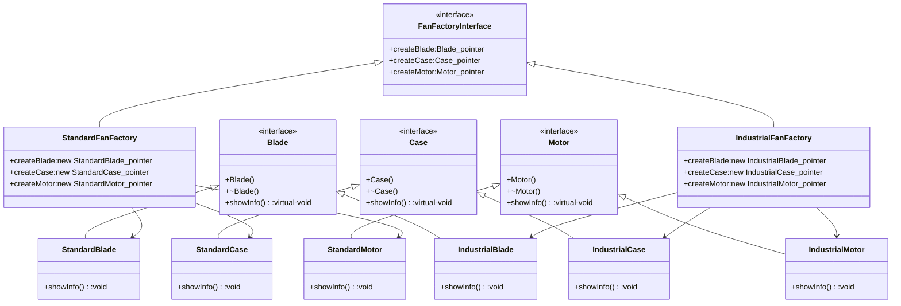

Encapsulate a set of object that is conceptually belong together and represent a family of product
## Classes Type

- Creator Class
	- Factory interface ([[Interface]] class)
		- [[Generalization]] of Factories
		- Functions/methods
			- create Products
	
	- Factories ([[Concrete Class]])  implements Factory [[Interface]]
		- Factories implement factory [[Interface]]
		- Functions/methods
			- create Products ([[Concrete Class]])
- Product Class
	- Product interface (interface class)
		- VIRTUAL METHOD (virtual void function_X()=0)
	
	- Products (concrete) implements Product [[Interface]]
		- Implement product [[Interface]]
		- Functions/methods
			- implement specific business logic


Example : 




## Pros and Cons

| Pros                                                                     | Cons                    |
| ------------------------------------------------------------------------ | ----------------------- |
| Easy to extend                                                           | Large Number of classes |
| increase modifiability                                                   |                         |
| consistency between product family (factory)                             |                         |
| isolate concrete class so easier to reuse                                |                         |
| add new family of product , no need to change existing code, obeying OCP |                         |
| minimize degree of complexity                                            |                         |


Sample code:
```cpp
#include <iostream>
using namespace std;

class BladeInterface {
public:
    BladeInterface() {}
    virtual ~BladeInterface() {}
    virtual void showBladeInfo() = 0;
};

class CaseInterface {
public:
    CaseInterface() {}
    virtual ~CaseInterface() {}
    virtual void showCaseInfo() = 0;
};

class MotorInterface {
public:
    MotorInterface() {}
    virtual ~MotorInterface() {}
    virtual void showMotorInfo() = 0;
};

  

class StandardBlade : public BladeInterface {
public:
    StandardBlade() {}
    ~StandardBlade() {}
    void showBladeInfo() override {
        cout << "Standard blade";
    }
};
  
class StandardCase : public CaseInterface {
public:
    StandardCase() {}
    ~StandardCase() {}
    void showCaseInfo() override {
        cout << "Standard Case";
    }
};
  
class StandardMotor : public MotorInterface {
public:
    StandardMotor() {}
    ~StandardMotor() {}
    void showMotorInfo() override {
        cout << "Standard Motor";
    }
};
  
class IndustrialBlade : public BladeInterface {
public:
    IndustrialBlade() {}
    ~IndustrialBlade() {}
    void showBladeInfo() override {
        cout << "Industrial blade";
    }
};
  
class IndustrialCase : public CaseInterface {
public:
    IndustrialCase() {}
    ~IndustrialCase() {}
    void showCaseInfo() override {
        cout << "Industrial Case";
    }
};
  
class IndustrialMotor : public MotorInterface {
public:
    IndustrialMotor() {}
    ~IndustrialMotor() {}
    void showMotorInfo() override {
        cout << "Industrial Motor";
    }
};
  
class FanFactoryInterface {
public:
    FanFactoryInterface() {}
    ~FanFactoryInterface() {}
    virtual void test() = 0;
    virtual BladeInterface *createBlade() = 0;
    virtual CaseInterface *createCase() = 0;
    virtual MotorInterface *createMotor() = 0;
};
  
class StandardFanFactory : public FanFactoryInterface {
public:
    StandardFanFactory() {}
    void test() {
        cout << "Standard Factory\n";
    }
    BladeInterface *createBlade() override {
        return new StandardBlade();
    }
    CaseInterface *createCase() override {
        return new StandardCase();
    }
    MotorInterface *createMotor() override {
        return new StandardMotor();
    }
};

class IndustrialFanFactory : public FanFactoryInterface {
public:
    IndustrialFanFactory() {}
    void test() {
        cout << "Industrial Factory\n";
    }

    BladeInterface *createBlade() override {
        return new IndustrialBlade();
    }
    CaseInterface *createCase() override {
        return new IndustrialCase();
    }
    MotorInterface *createMotor() override {
        return new IndustrialMotor();
    }
};

int main() {
    FanFactoryInterface *standardKilang = new StandardFanFactory();
    standardKilang->test();
    standardKilang->createBlade()->showBladeInfo();
}
```


Sample code 2:
```c#
namespace AbstractFactory
{
    /// <summary>
    /// An abstract product.
    /// </summary>
    abstract class Sandwich { }

    /// <summary>
    /// An abstract product.
    /// </summary>
    abstract class Dessert { }

    /// <summary>
    /// The Abstract Factory class, which defines methods for creating abstract objects.
    /// </summary>
    abstract class RecipeFactory
    {
        public abstract Sandwich CreateSandwich();
        public abstract Dessert CreateDessert();
    }

    /// <summary>
    /// A concrete product
    /// </summary>
    class BLT : Sandwich { }

    /// <summary>
    /// A concrete product
    /// </summary>
    class CremeBrulee : Dessert { }


    /// <summary>
    /// A concrete factory which creates concrete objects by implementing the abstract factory's methods.
    /// </summary>
    class AdultCuisineFactory : RecipeFactory
    {
        public override Sandwich CreateSandwich()
        {
            return new BLT();
        }

        public override Dessert CreateDessert()
        {
            return new CremeBrulee();
        }
    }

    /// <summary>
    /// A concrete product
    /// </summary>
    class PBandJ : Sandwich { }

    /// <summary>
    /// A concrete product
    /// </summary>
    class IceCreamSundae : Dessert { }

    /// <summary>
    /// A concrete factory which creates concrete objects by implementing the abstract factory's methods.
    /// </summary>
    class KidCuisineFactory : RecipeFactory
    {
        public override Sandwich CreateSandwich()
        {
            return new PBandJ();
        }

        public override Dessert CreateDessert()
        {
            return new IceCreamSundae();
        }
    }
}

using System;
using System.Collections.Generic;
using System.Linq;
using System.Text;
using System.Threading.Tasks;

namespace AbstractFactory
{
class Program
{
    /// <summary>
    /// The Abstract Factory pattern provides an interface for creating related families of objects
    /// without needing to specify the concrete implementations.  This pattern is critical for ideas
    /// like Dependency Injection.
    /// </summary>
    /// <param name="args"></param>
    static void Main(string[] args)
    {
        Console.WriteLine("Who are you? (A)dult or (C)hild?");
        char input = Console.ReadKey().KeyChar;
        RecipeFactory factory;
        switch(input)
        {
            case 'A':
                factory = new AdultCuisineFactory();
                break;

            case 'C':
                factory = new KidCuisineFactory();
                break;

            default:
                throw new NotImplementedException();

        }

        var sandwich = factory.CreateSandwich();
        var dessert = factory.CreateDessert();

        Console.WriteLine("\nSandwich: " + sandwich.GetType().Name);
        Console.WriteLine("Dessert: " + dessert.GetType().Name);

        Console.ReadKey();
    }
}
}

```