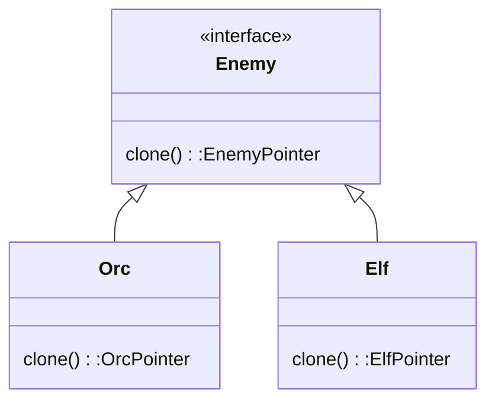

- Delegate the construction of copy (usually by copy constructor) to an interface

Class Type
- Creator and product are the same class





| Pros                                          | Cons |
| --------------------------------------------- | ---- |
| client dono internal struct of obj,           |      |
| easier to clone                               |      |
| less complex to clone                         |      |
| reduce class number (no need creator/product) |      |


Sample Code : 
```cpp
#include <iostream>
using namespace std;

class Enemy{
public:
    virtual Enemy* clone()=0;
};
  
class Orc:public Enemy{
public:
    string fat_belly;
    Orc()=default;
    Orc(Orc &a)=default;
    Orc* clone()override{
        return new Orc(*this);
    }
};
  
class Elf:public Enemy{
public:
    string long_ear;
    Elf()=default;
    Elf(const Elf& e)=default;
    Elf* clone()override{
        return new Elf(*this);
    }
};
  
int main(){
    Enemy* c=new Elf();
    Enemy* a=c->clone();
}
```


Sample Code 2:

```c#
using System;
using System.Collections.Generic;
using System.Linq;
using System.Text;
using System.Threading.Tasks;

namespace Prototype
{
    /// <summary>
    /// The Prototype abstract class
    /// </summary>
    abstract class SandwichPrototype
    {
        public abstract SandwichPrototype Clone();
    }

    class Sandwich : SandwichPrototype
    {
        private string Bread;
        private string Meat;
        private string Cheese; //I will use this pun everywhere I can
        private string Veggies;

        public Sandwich(string bread, string meat, string cheese, string veggies)
        {
            Bread = bread;
            Meat = meat;
            Cheese = cheese;
            Veggies = veggies;
        }

        public override SandwichPrototype Clone()
        {
            string ingredientList = GetIngredientList();
            Console.WriteLine("Cloning sandwich with ingredients: {0}", ingredientList.Remove(ingredientList.LastIndexOf(",")));

            return MemberwiseClone() as SandwichPrototype;
        }

        private string GetIngredientList()
        {
            var ingredientList = "";
            if (!string.IsNullOrWhiteSpace(Bread))
            {
                ingredientList += Bread + ", ";
            }
            if (!string.IsNullOrWhiteSpace(Meat))
            {
                ingredientList += Meat + ", ";
            }
            if (!string.IsNullOrWhiteSpace(Cheese))
            {
                ingredientList += Cheese + ", ";
            }
            if (!string.IsNullOrWhiteSpace(Veggies))
            {
                ingredientList += Veggies + ", ";
            }
            return ingredientList;
        }
    }

    class SandwichMenu
    {
        private Dictionary<string, SandwichPrototype> _sandwiches = new Dictionary<string, SandwichPrototype>();

        public SandwichPrototype this[string name]
        {
            get { return _sandwiches[name]; }
            set { _sandwiches.Add(name, value); }
        }
    }
}

using System;
using System.Collections.Generic;
using System.Linq;
using System.Text;
using System.Threading.Tasks;

namespace Prototype
{
    class Program
    {
        static void Main(string[] args)
        {
            SandwichMenu sandwichMenu = new SandwichMenu();

            // Initialize with default sandwiches
            sandwichMenu["BLT"] = new Sandwich("Wheat", "Bacon", "", "Lettuce, Tomato");
            sandwichMenu["PB&J"] = new Sandwich("White", "", "", "Peanut Butter, Jelly");
            sandwichMenu["Turkey"] = new Sandwich("Rye", "Turkey", "Swiss", "Lettuce, Onion, Tomato");

            // Catering manager adds custom sandwiches
            sandwichMenu["LoadedBLT"] = new Sandwich("Wheat", "Turkey, Bacon", "American", "Lettuce, Tomato, Onion, Olives");
            sandwichMenu["ThreeMeatCombo"] = new Sandwich("Rye", "Turkey, Ham, Salami", "Provolone", "Lettuce, Onion");
            sandwichMenu["Vegetarian"] = new Sandwich("Wheat", "", "", "Lettuce, Onion, Tomato, Olives, Spinach");

            // Now we can clone the sandwiches.
            Sandwich sandwich1 = sandwichMenu["BLT"].Clone() as Sandwich;
            Sandwich sandwich2 = sandwichMenu["ThreeMeatCombo"].Clone() as Sandwich;
            Sandwich sandwich3 = sandwichMenu["Vegetarian"].Clone() as Sandwich;

            Console.ReadKey();
        }
    }
}

```