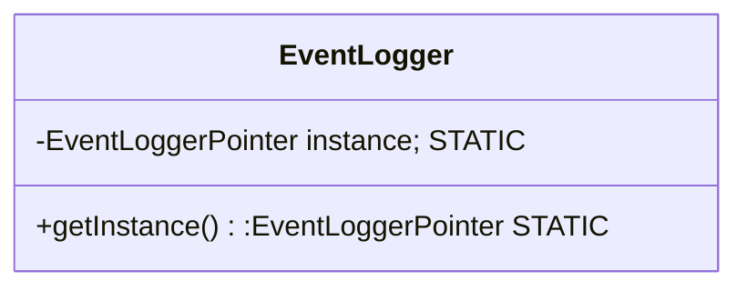

- ensure only one instance of object at any point in time

- compose of
	- 2 static member
		- Object* of the class
		- getInstance




| Pros                                      | Cons |
| ----------------------------------------- | ---- |
| controlled access to single instance      |      |
| reduced namespace                         |      |
| can be customized to add # no of instance |      |


```cpp
#include <iostream>
using namespace std;

class EventLogger{
    static EventLogger* instance;
    EventLogger()=default;
    string k;
public:
    static EventLogger* getInstance(){
        if(!instance){
            instance=new EventLogger();
        }
        return instance;
    }
    void setK(string k){
        this->k=k;
    }
    void printK(){
        cout<<""+k+"\n";
    }
};

//THIS IS IMPORTANT
EventLogger* EventLogger::instance = nullptr;
//static mmbr is accessible by everyone LOL.. ? ACTUALLY NOT TRUE

int main(){
    EventLogger* one=EventLogger::getInstance();
    one->setK("one");
    one->printK();
    EventLogger* two=EventLogger::getInstance();
    two->printK();
    two->setK("two");
    two->printK();
    one->printK();
}
```


Sample Code 2 :


```c#
using System;
using System.Collections.Generic;
using System.Linq;
using System.Text;
using System.Threading.Tasks;

namespace Singleton
{
    /// <summary>
    /// Singleton
    /// </summary>
    public sealed class TheBell
    {
        private static TheBell bellConnection;
        private static object syncRoot = new Object();
        private TheBell()
        {

        }

        /// <summary>
        /// We implement this method to ensure thread safety for our singleton.
        /// </summary>
        public static TheBell Instance
        {
            get
            {
                lock(syncRoot)
                {
                    if(bellConnection == null)
                    {
                        bellConnection = new TheBell();
                    }
                }

                return bellConnection;
            }
        }

        public void Ring()
        {
            Console.WriteLine("Ding! Order up!");
        }
    }
}


using System;
using System.Collections.Generic;
using System.Linq;
using System.Text;
using System.Threading.Tasks;

namespace Singleton
{
    class Program
    {
        static void Main(string[] args)
        {
            var bell = TheBell.Instance;
            bell.Ring();

            Console.ReadKey();
        }
    }
}

```