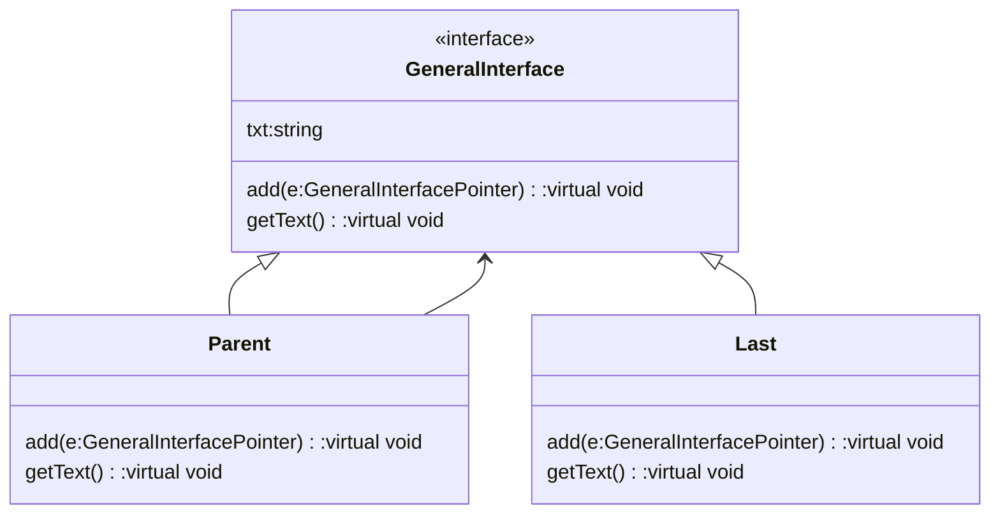

- large tree-like structure 
- whole-part relationship
- treat leaf/parent uniformly

Class type
- general interface
- parent(implement general interface)
- Leaf(implement general interface)





| Pros                                | Cons                            |
| ----------------------------------- | ------------------------------- |
| Support composite and primitive obj | overly general                  |
| easy to create/add new component    | difficult to restrict obj types |
| minimize complexity                 |                                 |

Sample Code:
```cpp
#include <iostream>
#include <list>
using namespace std;
  
class GeneralInterface{
public:
    string txt;
    virtual void add(GeneralInterface*)=0;
    virtual void setText(string)=0;
    virtual void getText()=0;
};
  
class Parent:public GeneralInterface{
public:
    list<GeneralInterface*> list;
    void add(GeneralInterface* e)override{
        list.push_back(e);
    }
    void setText(string e)override{
        txt=e;
    }
    void getText()override{
        cout<<txt<<"\n";
        for(GeneralInterface* e:list)
            e->getText();
    }
};
  
class Term:public GeneralInterface{
public:
    void add(GeneralInterface* e)override{
        cout<<"Cannot add to GeneralInterface\n";
    }
    void setText(string e)override{
        txt=e;
    }
    void getText()override{
        cout<<txt<<"\n";
    }
};
  
int main(){
    Term* last=new Term();
    last->setText("I am last");
    Parent* contain=new Parent();
    Parent* contain2=new Parent();
    
    contain->setText("aaa");
    contain->add(contain2);
    contain2->setText("bbb");
    contain2->add(last);
    contain->getText();
}
```