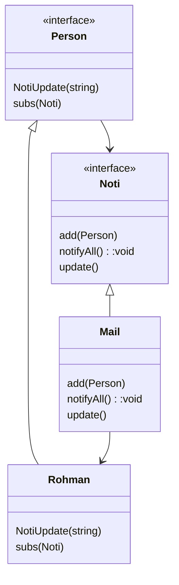

- update an object that subscribe to a service

classes
- noti/service interface
- noti/service concrete
- "Subscribers" interface, have noti interface
- concrete class have Subscribers list



| Pros                              | Cons |
| --------------------------------- | ---- |
| can add more service              |      |
| maintaining and modifying is easy |      |
Sample Code:

```cpp
#include <list>
#include <iostream>
using namespace std;
  
class Noti;
  
class Person{
public:
    virtual void subs(Noti*)=0;
    virtual void NotiUpdate(string)=0;
};
  
class Noti{
public:
    virtual void add(Person*)=0;
    virtual void update()=0;
};
  

class Mail:public Noti{
list<Person*> _list;
public:
    void add(Person* e)override{
        _list.push_back(e);
    };
    void notifyAll(){
        update();
    }
    void update(){
        for(Person* p:_list){
            p->NotiUpdate("PUBLIC MAIL");
        }
    };
};
  
class Rohman:public Person{
public:
    Noti* notificat;
    void subs(Noti* e)override{
        notificat=e;
        e->add(this);
    }
    void NotiUpdate(string e)override{
        cout<<e;
    }
};
  
int main(){
    Person* p;
    p=new Rohman();
    Noti* m=new Mail();
    p->subs(m);
  
    m->update();
 
```
