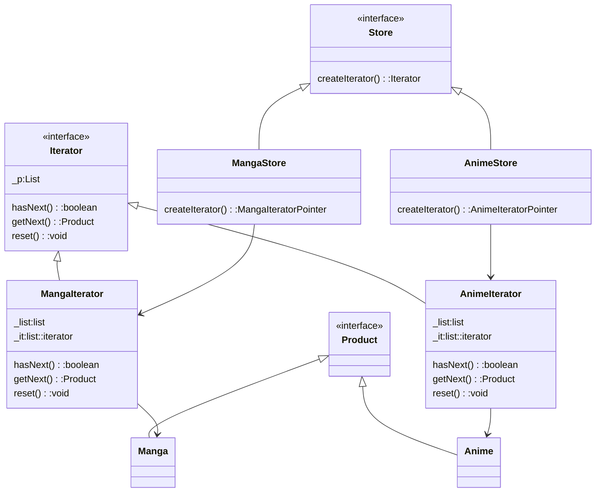

- standardized way for accessing/traversing objects

classes
- interface to create Iterator
- Iterator interface
- product interface

Notes
- list should be in concrete iterator/ or preferably in the store




| Pros                                | Cons |
| ----------------------------------- | ---- |
| consistent way to iterate           |      |
| abstract internal collection of obj |      |
| client code can be extend easily    |      |


Sample Code:

```cpp
#include <iostream>
#include <list>

using namespace std;
  
class Product{
public:
    string name;
    virtual void printName()=0;
};
  
class Iterator{
public:
    virtual bool hasNext()=0;
    virtual Product* getNext()=0;
    virtual void reset()=0;
};
  

class Store{
public:
    virtual Iterator* createIterator(list<Product*>&)=0;
};
  
class Manga:public Product{
public:
    Manga(string e){name=e;}
    void printName()override{
        cout<<name<<"\n";
    }
};

class Anime:public Product{
public:
    Anime(string e){name=e;}
    void printName()override{
        cout<<name<<"\n";
    }
};
  
class MangaIterator:public Iterator{
list<Product*> _list;
list<Product*>::iterator it;
public:
    MangaIterator(list<Product*>& mangaList) : _list(mangaList), it(mangaList.begin()) {}  
    bool hasNext(){
        return it!=_list.end();
    }
    Product* getNext(){
        if (hasNext()) {
            return *(it++);
        }
        return nullptr;
    }
    void reset(){
        it = _list.begin();
    }
};
  
class MangaStore:public Store{
public:
    MangaIterator* createIterator(list<Product*>& mangaList)override{
        return new MangaIterator(mangaList);
    }
};
  
class AnimeIterator:public Iterator{
list<Product*> _list;
list<Product*>::iterator it;
public:
    AnimeIterator(list<Product*>& AnimeList) : _list(AnimeList), it(AnimeList.begin()) {}  
    bool hasNext(){
        return it!=_list.end();
    }
    Product* getNext(){
        if (hasNext()) {
            return *(it++);
        }
        return nullptr;
    }
    void reset(){
        it = _list.begin();
    }
};
  
class AnimeStore:public Store{
public:
    AnimeIterator* createIterator(list<Product*>& AnimeList)override{
        return new AnimeIterator(AnimeList);
    }
};

int main(){
    Store* store;
    store=new AnimeStore();
    list<Product*> _animeList;
    _animeList.push_back(new Anime("Aot"));
    _animeList.push_back(new Anime("KMY"));
    _animeList.push_back(new Anime("ONK"));
  
    list<Product*> _mangaList;
    _mangaList.push_back(new Manga("Kanan sama"));
    _mangaList.push_back(new Manga("BEEJOE"));
    _mangaList.push_back(new Manga("KAELA"));
  
    Iterator* it=store->createIterator(_animeList);
  
    it->getNext()->printName();
    it->getNext()->printName();
    it->getNext()->printName();
    store=new MangaStore();

    it=store->createIterator(_mangaList);    
    it->getNext()->printName();
    it->getNext()->printName();
    it->getNext()->printName();
}
```