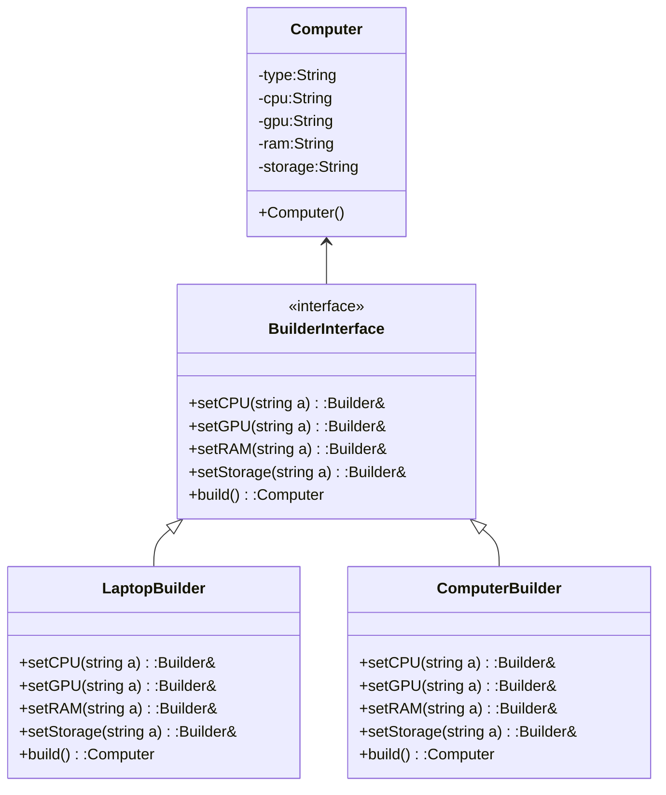

- delegate the creation of complex object to a builder class
- multistep process to create single object

- can have director which is just collection of predefined builds

Class type
- Factory
	- Builder [[Interface]]  (OPTIONAL)
	- Concrete Builder
- Product
	- Concrete Product
- Director (OPTIONAL)
	




| Pros                                                                                                           | Cons |
| -------------------------------------------------------------------------------------------------------------- | ---- |
| separate construction from representation                                                                      |      |
| change representation without modifying construction                                                           |      |
| control over construction process, can be created at discrete point in time (wont build until build basically) |      |


Sample Code : 

```cpp
#include <iostream>
using namespace std;

class Computer{
    string type,cpu, gpu, ram, storage;
public:
    Computer(string t,string c,string g,string r,string s){
        type=t;
        cpu=c;
        gpu=g;
        ram=r;
        storage=s;
    }
  
    void getInfo(){
        cout<<"TYPE :"+type+"\n";
        cout<<"CPU :"+cpu+"\n";
        cout<<"GPU :"+gpu+"\n";
        cout<<"RAM :"+ram+"\n";
        cout<<"Storage :"+storage+"\n";
    }
};
  
class Builder{
public:
    virtual Builder& setcpu(string c)=0;
    virtual Builder& setgpu(string c)=0;  
    virtual Builder& setram(string c)=0;
    virtual Builder& setstorage(string c)=0;
    virtual Computer* build()=0;
};

class ComputerBuilder:public Builder{
    string cpu, gpu, ram, storage;
public:
    ComputerBuilder()=default;
    ComputerBuilder& setcpu(string c)override{cpu=c;return *this;}
    ComputerBuilder& setgpu(string c)override{gpu=c;return *this;}  
    ComputerBuilder& setram(string c)override{ram=c;return *this;}
    ComputerBuilder& setstorage(string c)override{storage=c;return *this;}
    Computer* build()override{
        return new Computer("Computer",cpu,gpu,ram,storage);
    }
};

class LaptopBuilder : public Builder{
    string cpu, gpu, ram, storage;
public:
    LaptopBuilder()=default;
    LaptopBuilder& setcpu(string c)override{cpu=c;return *this;}
    LaptopBuilder& setgpu(string c)override{gpu=c;return *this;}  
    LaptopBuilder& setram(string c)override{ram=c;return *this;}
    LaptopBuilder& setstorage(string c)override{storage=c;return *this;}
    Computer* build()override{
        return new Computer("Laptop",cpu,gpu,ram,storage);
    }
};
  
class Director{
public:
    Computer* buildNvidia(Builder& b){
        return b.setcpu("").setgpu("NVIDIA").setram("16Gb").build();
    }
};

int main(){
    ComputerBuilder buildComp;
    buildComp.setcpu("Intel").setgpu("Nvidia");
    Computer* b=buildComp.build();
    b->getInfo();
    cout<<"\n\n";
    Director d;
    Computer* a=d.buildNvidia(buildComp);
    a->getInfo();
}
```


Sample Code 2 :
```c#
using System;
using System.Collections.Generic;
using System.Linq;
using System.Text;
using System.Threading.Tasks;

namespace Builder
{
    /// <summary>
    /// The Director
    /// </summary>
    class AssemblyLine
    {
        // Builder uses a complex series of steps
        // 
        public void Assemble(SandwichBuilder sandwichBuilder)
        {
            sandwichBuilder.AddBread();
            sandwichBuilder.AddMeats();
            sandwichBuilder.AddCheese();
            sandwichBuilder.AddVeggies();
            sandwichBuilder.AddCondiments();
        }
    }

    /// <summary>
    /// The Builder abstract class
    /// </summary>
    abstract class SandwichBuilder
    {
        protected Sandwich sandwich;

        // Gets sandwich instance
        public Sandwich Sandwich
        {
            get { return sandwich; }
        }

        // Abstract build methods
        public abstract void AddBread();
        public abstract void AddMeats();
        public abstract void AddCheese();
        public abstract void AddVeggies();
        public abstract void AddCondiments();
    }

    /// <summary>
    /// A Concrete Builder class
    /// </summary>
    class TurkeyClub : SandwichBuilder
    {
        public TurkeyClub()
        {
            sandwich = new Sandwich("Turkey Club");
        }

        public override void AddBread()
        {
            sandwich["bread"] = "12-Grain";
        }

        public override void AddMeats()
        {
            sandwich["meat"] = "Turkey";
        }

        public override void AddCheese()
        {
            sandwich["cheese"] = "Swiss";
        }

        public override void AddVeggies()
        {
            sandwich["veggies"] = "Lettuce, Tomato";
        }

        public override void AddCondiments()
        {
            sandwich["condiments"] = "Mayo";
        }
    }


    /// <summary>
    /// A Concrete Builder class
    /// </summary>
    class BLT : SandwichBuilder
    {
        public BLT()
        {
            sandwich = new Sandwich("BLT");
        }

        public override void AddBread()
        {
            sandwich["bread"] = "Wheat";
        }

        public override void AddMeats()
        {
            sandwich["meat"] = "Bacon";
        }

        public override void AddCheese()
        {
            sandwich["cheese"] = "None";
        }

        public override void AddVeggies()
        {
            sandwich["veggies"] = "Lettuce, Tomato";
        }

        public override void AddCondiments()
        {
            sandwich["condiments"] = "Mayo, Mustard";
        }
    }

    /// <summary>
    /// A Concrete Builder class
    /// </summary>
    class HamAndCheese : SandwichBuilder
    {
        public HamAndCheese()
        {
            sandwich = new Sandwich("Ham and Cheese");
        }

        public override void AddBread()
        {
            sandwich["bread"] = "White";
        }

        public override void AddMeats()
        {
            sandwich["meat"] = "Ham";
        }

        public override void AddCheese()
        {
            sandwich["cheese"] = "American";
        }

        public override void AddVeggies()
        {
            sandwich["veggies"] = "None";
        }

        public override void AddCondiments()
        {
            sandwich["condiments"] = "Mayo";
        }
    }

    /// <summary>
    /// The Product class
    /// </summary>
    class Sandwich
    {
        private string _sandwichType;
        private Dictionary<string, string> _ingredients = new Dictionary<string, string>();

        // Constructor
        public Sandwich(string sandwichType)
        {
            this._sandwichType = sandwichType;
        }

        // Indexer
        public string this[string key]
        {
            get { return _ingredients[key]; }
            set { _ingredients[key] = value; }
        }

        public void Show()
        {
            Console.WriteLine("\n---------------------------");
            Console.WriteLine("Sandwich: {0}", _sandwichType);
            Console.WriteLine(" Bread: {0}", _ingredients["bread"]);
            Console.WriteLine(" Meat: {0}", _ingredients["meat"]);
            Console.WriteLine(" Cheese: {0}", _ingredients["cheese"]);
            Console.WriteLine(" Veggies: {0}", _ingredients["veggies"]);
            Console.WriteLine(" Condiments: {0}", _ingredients["condiments"]);
        }
    }
}

using System;
using System.Collections.Generic;
using System.Linq;
using System.Text;
using System.Threading.Tasks;

namespace Builder
{
    class Program
    {
        static void Main(string[] args)
        {
            SandwichBuilder builder;

            // Create deli with sandwich assembly line
            AssemblyLine shop = new AssemblyLine();

            // Construct and display sandwiches
            builder = new HamAndCheese();
            shop.Assemble(builder);
            builder.Sandwich.Show();

            builder = new BLT();
            shop.Assemble(builder);
            builder.Sandwich.Show();

            builder = new TurkeyClub();
            shop.Assemble(builder);
            builder.Sandwich.Show();

            // Wait for user
            Console.ReadKey();
        }
    }
}

```