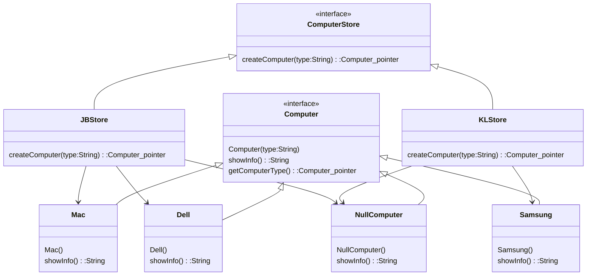

Encapsulate and defer object instantiation to derived classes
Basically the same as [[Abstract Factory]], except this is for a single object

Class type
- Creator
	- Creator [[Interface]]
	- Concrete Creator
- Product
	- Product [[Interface]]
	- Concrete Product

Example : 




Pros and cons

| Pros                                                        | Cons |
| ----------------------------------------------------------- | ---- |
| Separate code from product specific class                   |      |
| easier to reuse and maintain                                |      |
| more efficient development, dev can work on separate things |      |


Sample Code : 
```cpp
#include <iostream>
using namespace std;

class Computer{
public:
    Computer(){}
    ~Computer(){}
    void virtual getComputerName(){}
};
  
class ComputerStore{
public:
    ComputerStore(){}
    virtual Computer* createComputer(string)=0;
};
  
class Dell:public Computer{
public:
    Dell(){}
    ~Dell(){}
    void getComputerName(){
        cout<<"Dell\n";
    }
};

class Mac:public Computer{
public:
    Mac(){}
    ~Mac(){}
    void getComputerName(){
        cout<<"Mac\n";
    }
};

class Samsung:public Computer{
public:
    Samsung(){}
    ~Samsung(){}
    void getComputerName(){
        cout<<"Samsung";
    }
};
  
class NullComputer:public Computer{
public:
    NullComputer(){}
    ~NullComputer(){}
    void getComputerName(){
        cout<<"This store doesnt carry that computer ok\n";
    }
};
  
class JBStore:public ComputerStore{
public:
    JBStore(){
        cout<<"JB Branch\n";
    }
    ~JBStore(){}
    Computer* createComputer(string a) override  {
        if(a=="Dell")
            return new Dell();
        else if(a=="Mac")
            return new Mac();
        else
            return new NullComputer();
    }
};
  
class KLStore:public ComputerStore{
public:
    KLStore(){
        cout<<"KL Branch\n";
    }
    ~KLStore(){}
    Computer* createComputer (string a) override {
        Computer *Comp;
        if(a=="Samsung")
            Comp= new Samsung();
        else if(a=="Mac")
            Comp= new Mac();
        else
            Comp=new NullComputer();
  
        return Comp;
    }
};
  
int main(){
    ComputerStore* jb=new KLStore();
    jb->createComputer("Mac")->getComputerName();
}
```


Sample Code 2:

```c#
namespace Flyweight
{
    /// <summary>
    /// The Flyweight Factory class
    /// </summary>
    class SliderFactory
    {
        private Dictionary<char, Slider> _sliders =
            new Dictionary<char, Slider>();

        public Slider GetSlider(char key)
        {
            Slider slider = null;
            if (_sliders.ContainsKey(key)) //If we've already created an instance of the requested type of slider, just use that.
            {
                slider = _sliders[key];
            }
            else //Otherwise, create a brand new slider instance.
            {
                switch (key)
                {
                    case 'B': slider = new BaconMaster(); break;
                    case 'V': slider = new VeggieSlider(); break;
                    case 'Q': slider = new BBQKing(); break;
                }
                _sliders.Add(key, slider);
            }
            return slider;
        }
    }

    /// <summary>
    /// The 'Flyweight' abstract class
    /// </summary>
    abstract class Slider
    {
        protected string Name;
        protected string Cheese;
        protected string Toppings;
        protected decimal Price;

        public abstract void Display(int orderTotal);
    }

    /// <summary>
    /// A  Concrete Flyweight class
    /// </summary>
    class BaconMaster : Slider
    {
        public BaconMaster()
        {
            Name = "Bacon Master";
            Cheese = "American";
            Toppings = "lots of bacon";
            Price = 2.39m;
        }

        public override void Display(int orderTotal)
        {
            Console.WriteLine("Slider #" + orderTotal + ": " + Name + " - topped with " + Cheese + " cheese and " + Toppings + "! $" + Price.ToString());
        }
    }

    /// <summary>
    /// A Concrete Flyweight class
    /// </summary>
    class VeggieSlider : Slider
    {
        public VeggieSlider()
        {
            Name = "Veggie Slider";
            Cheese = "Swiss";
            Toppings = "lettuce, onion, tomato, and pickles";
            Price = 1.99m;
        }

        public override void Display(int orderTotal)
        {
            Console.WriteLine("Slider #" + orderTotal + ": " + Name + " - topped with " + Cheese + " cheese and " + Toppings + "! $" + Price.ToString());
        }

    }

    /// <summary>
    /// A Concrete Flyweight class
    /// </summary>
    class BBQKing : Slider
    {
        public BBQKing()
        {
            Name = "BBQ King";
            Cheese = "American";
            Toppings = "Onion rings, lettuce, and BBQ sauce";
            Price = 2.49m;
        }

        public override void Display(int orderTotal)
        {
            Console.WriteLine("Slider #" + orderTotal + ": " + Name + " - topped with " + Cheese + " cheese and " + Toppings + "! $" + Price.ToString());
        }
    }
}

using System;
using System.Collections.Generic;
using System.Linq;
using System.Text;
using System.Threading.Tasks;

namespace Flyweight
{
    class Program
    {
        static void Main(string[] args)
        {
            // Build a slider order using patron's input
            Console.WriteLine("Please enter your slider order (use characters B, V, Q with no spaces):");
            var order = Console.ReadLine();
            char[] chars = order.ToCharArray();

            SliderFactory factory = new SliderFactory();

            int orderTotal = 0;

            //Get the slider from the factory
            foreach (char c in chars)
            {
                orderTotal++;
                Slider character = factory.GetSlider(c);
                character.Display(orderTotal);
            }

            Console.ReadKey();
        }
    }
}
```