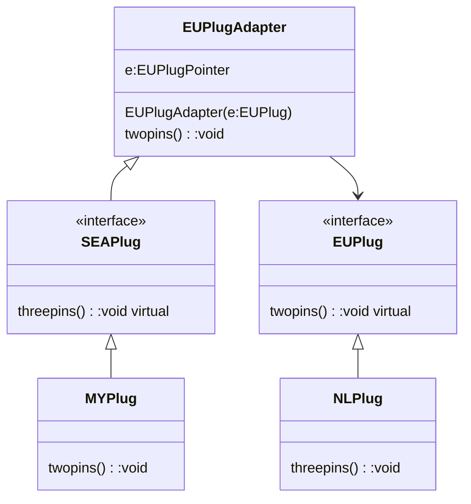

- class/object that adapt an existing implementation/implementation 

Class type
- Adapter implements existing implementation
- Adapter associate with new implementation


In example below, we are using SEAPlug in main()



| Pros                                                                       | Cons                            |
| -------------------------------------------------------------------------- | ------------------------------- |
| Allow class with incompatible interface to work together                   | complexity increase             |
| Standard way to integrate plurality of different type to existing software | add layers,, impact performance |

Sample Code :

```cpp
#include <iostream>
using namespace std;

  
class SEAPlug{
public:
    SEAPlug()=default;
    virtual void threepins()=0;
};

class EUPlug{
public:
    EUPlug()=default;
    virtual void twopins()=0;
};

class MYPlug : public SEAPlug{
public:
    MYPlug()=default;
    void threepins()override{cout<<"MY,Yes, we are three british'ed\n";}
};

class NLPlug : public EUPlug{
public:
    NLPlug()=default;
    void twopins()override{cout<<"NL,Yes, we are two pins\n";}
};

class EUPlugAdapter:public SEAPlug{
public:
    EUPlug* eu;
    EUPlugAdapter(EUPlug* e){eu=e;}
    void threepins()override{eu->twopins();}
};

int main(){
    NLPlug* nl=new NLPlug();
    MYPlug* my=new MYPlug();
    EUPlugAdapter* euA=new EUPlugAdapter(nl);
    SEAPlug* all=my;

    all->threepins();
    all=euA;
    all->threepins();
}
```