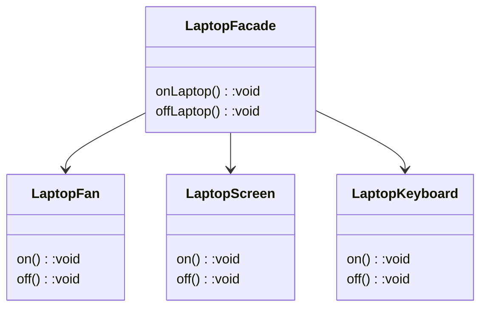

- simple interface to control multiple subsystem




| Pros                                 | Cons                                                  |
| ------------------------------------ | ----------------------------------------------------- |
| minimize complexity                  | bottleneck if overloaded with too much responsibility |
| hide complexity                      | limit flexibility                                     |
| stable interface, stable client code |                                                       |
| weak coupling on client              |                                                       |


Sample code:

```cpp
#include <iostream>
using namespace std;

class LaptopFan{
public:
    void on(){cout<<"Laptop fan on\n";}
    void off(){cout<<"Laptop fan off\n";}
};
  
class LaptopScreen{
public:
    void on(){cout<<"Laptop Screen on\n";}
    void off(){cout<<"Laptop Screen off\n";}
};
  
class LaptopKeyboard{
public:
    void on(){cout<<"Laptop Keyboard on\n";}
    void off(){cout<<"Laptop Keyboard off\n";}
};
  
class LaptopFacade{
    LaptopFan* f;
    LaptopScreen* s;
    LaptopKeyboard* k;
public:
    LaptopFacade(){
        f=new LaptopFan();
        s=new LaptopScreen();
        k=new LaptopKeyboard();
    }
    void onLaptop(){
        f->on();
        k->on();
        s->on();
    }
    void offLaptop(){
        f->off();
        k->off();
        s->off();
    }
};

int main(){
    LaptopFacade lappy;
    lappy.onLaptop();
    lappy.offLaptop();
}
```